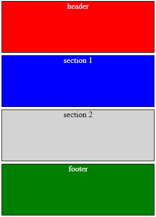

# Chapter 1, Topic 1 - Basic Blocks

## Step 1 

This is a description of Step 1 of creating four basic blocks on a page.

 

Steps can be broken down into multiple items or sub-steps.  A simple - in Markdown will be converted into a bullet point with the proper indentation, just like an un-ordered &lt;li&gt; in HTML.  An ordered list is created by just entering 1., 2. 3. etc. 
- Item 1 
- Item 2 
- Item 3 
- Item 4 

Here are numberd steps each contain some combination of text and images

 1. Sub-Step 1  
    This is what you do next.  
      

 2. Sub-Step 2  
     

 3. Sub-Step 3
     

 4. Sub-Step 4
    You'll notice that the text and images above appear indented under the each sub-step.

&nbsp;  
 
## Step 2

One thing that Markdown doesn't support is a blank line.  However, one nice thing about (most) Markdown renderser is that, they support regular old HTML.  So you can use the &lt;br&gt; as above.  (And since it's really HTML, you have to escape the less than and greater-than symbols.


Note that the image is now indented based on the margin of the Step 2 heading. You can't really change this, unless you add your own style to the image using the HTML &lt;img&gt; tag.  

&nbsp;  

## Step 3
Another great thing about Markdow, give then it designed primarily for documenting programs, is that it will color code you HTML or Javascript code.  Just create add your block of code between two lines that contain ``` like this:
```
  <html>
    <head>
    </head>
    <body>
      Hello
    </body>
  </html>
```   
You can even color code you code for a specific language.  Just follow the three ticks with the name of the language, e.g. ```javascript (all lowercase), like tis:  
```javascript
  if (a == b)  { 
     console.log( "hello" )
     } 
```
Specifying that the code is markdown, we can see what this page looks like underneath the covers.  
```markdown
# Welcome to Chapter 1, Section 1 Basic Blocks

## Step 1 

This is a description of Step 1 of creating four basic blocks on a page.

 

Steps can be broken down into multiple items or sub-steps.  A simple - in 
Markdown will be converted into a bullet point with the proper indentation,  
just like an un-ordered &lt;li&gt; in HTML.  An ordered list is created by  
entering 1., 2. 3. etc. 
- Item 1 
- Item 2 
- Item 3 
- Item 4 

Here are numberd steps each contain some combination of text and images

 1. Sub-Step 1  
    This is what you do first.  
     

 2. Sub-Step 2
     

 3. Sub-Step 3
    This is what you do next.  

 4. Sub-Step 4
    You'll notice that the text and images above appear indented under 
    each sub-step.

&nbsp;  
 
## Step 2

One thing that Markdown doesn't support is a blank line.  However, one nice thing 
about (most) Markdown renderser is that, they support regular old HTML.  So you 
can use the &lt;br&gt; as above.  (And since it's really HTML, you have to escape 
the less than and greater-than symbols.


Note that the image is now indented based on the margin of the Step 2 heading. 
You can't really change this, unless you add your own style to the image using 
the HTML &lt;img&gt; tag.  

&nbsp;  

## Step 3
Another great thing about Markdown, given that it is designed primarily for 
documenting programs, is that it will color code you HTML or Javascript code.  
Just create add your block of code between two lines that contain ``` like this:
[```]

  <html>
    <head>
    </head>
    <body>
      Hello
    </body>
  </html>
[```]

You can even color code you code for a specific language.  Just follow the three ticks 
with the name of the language, e.g. ```javascript (all lowercase), like this:  
[```javascript]
  if (a == b)  { 
     console.log( "hello" )
     } 
[```]

Specifying that the code is markdown, we can see what this page looks like underneath 
the covers.
[```markdown]
    ... 
[```]
``` 
